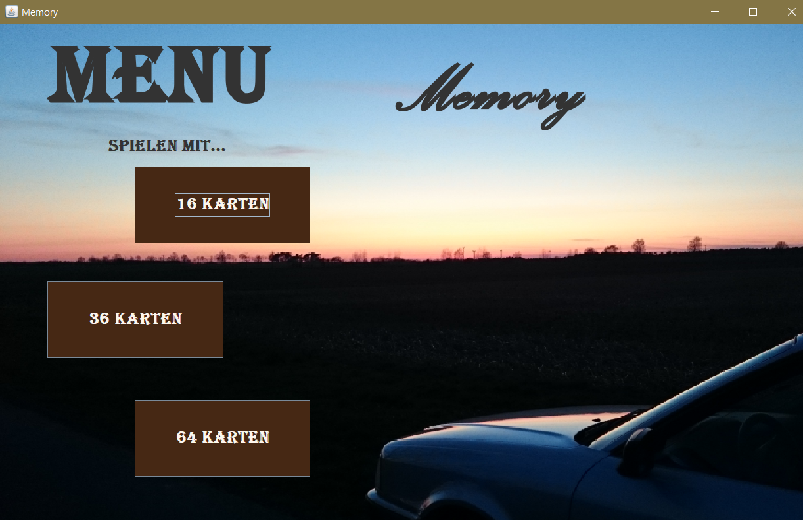
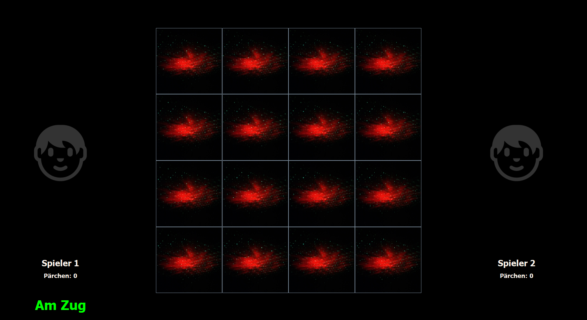
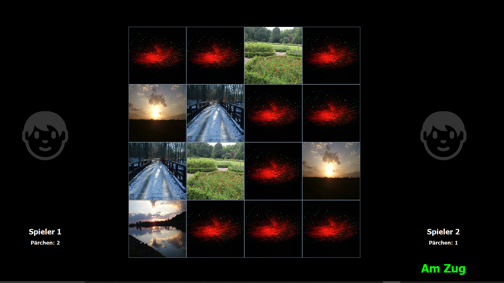
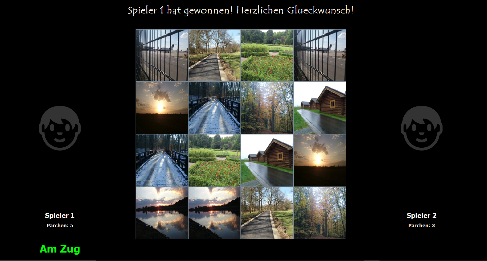

> 🇩🇪 [Deutsche Version – README_DE.md](README_DE.md)

# GUI Memory Game

A GUI-based two-player memory card game written in Java Swing.

## About the Project

This project is a further development of the „console-memory-game" repository and is likewise one of my first fully independently developed programs. It reflects my first steps in software development and is intended to document my growth as a programmer.

The project was prepared to be runnable on GitHub, meaning it was partially modified. The modifications include replacing the assets with personal photographs, removing audio sounds, and fixing individual broken sections of code.
In order to authentically document the original programming style and rudimentary development approaches, no further optimization was carried out — despite known issues and insufficient code quality.

## Features

- **1v1 Game Mode** — Two players compete locally on the same keyboard and mouse. The goal is to uncover as many matching card pairs as possible.

- **Multiple Board Sizes** — Before starting the game, players can choose between three difficulty levels:
  - 16 cards
  - 36 cards
  - 64 cards

- **Graphical User Interface** — The game runs in a full-screen Java Swing window with image-based cards, player panels, and a live score display.

- **Turn Indicator** — The current player is highlighted with a green "Am Zug" (Your Turn) label.

- **Automatic Game Evaluation** — Once all card pairs have been found, the game automatically ends and announces the winner.

---

## Requirements

- **Java:** JDK 8 – 16

  > ⚠️ **Important:** This project uses `java.util.Observable` and `java.util.Observer`, which were deprecated in Java 9 and **fully removed in Java 17**. The code will **not compile on Java 17 or higher** without modification. Use a JDK version between 8 and 16.
  >
  > 📥 Download a compatible JDK: [https://adoptium.net](https://adoptium.net) — select version **11** or **16** under *"Other platforms & versions"*

- **Operating System:** Windows, macOS, or Linux

---

## Installation & Launch

1. Clone or download the repository
2. Navigate into the `src` directory:

```
cd gui-memory-game/src
```

3. Compile the Java files:

```
javac *.java
```

4. Start the game:

```
java MemoryGUI
```

> **Note:** The `assets/` folder must remain inside `src/` so the images are found correctly at runtime.

---

## How to Play

### 1. Start the Game

Launch the program as described above. The main menu appears.

### 2. Choose Board Size

Click one of the three buttons to start a game:

- `16 Karten`
- `36 Karten`
- `64 Karten`



### 3. Flip Cards

Click any face-down card to reveal it. Each turn consists of flipping exactly two cards.



### 4. Find Matching Pairs

- If both cards match:
  - they remain visible
  - the player earns one point
  - the player gets another turn



### 5. Win the Game

The game automatically ends once all pairs have been found. The player with the most points wins.



---

## Rules

- The game is played by **Player 1** and **Player 2**
- Player 1 always starts
- Each turn consists of flipping exactly two cards
- If both cards match: they remain visible, the player earns a point and may continue
- If the cards do not match: they are flipped back after a short delay and the next player takes their turn
- The game ends when all pairs have been found

---

## Project Structure

```
gui-memory-game/
├── src/
│   ├── MemoryGUI.java       # Main menu (View)
│   ├── PlaymetGUI.java      # Game screen with player panels (View)
│   ├── Game.java            # Game logic & card layout (Model + Observer)
│   ├── Card.java            # Individual card component (Model)
│   ├── Player.java          # Player state & turn logic (Model + Observable)
│   ├── ActionHandler.java   # Event controller (Controller)
│   └── assets/
│       ├── card-img/        # Card face images (A–Z and special characters)
│       ├── misc-img/        # Menu background & card back image
│       └── rdme/            # Screenshots for the README
├── README.md
├── README_DE.md
├── LICENSE
├── LICENSE_ASSETS.md
└── .gitignore
```

---

## License

The source code of this project is licensed under the [MIT License](LICENSE).  
© 2026 Hermann Schmidt

---

## Image License

The images in `src/assets/card-img/` and `src/assets/misc-img/` are personal photographs by Hermann Schmidt taken across various years and are **not** covered by the MIT License.

They are licensed under [CC BY-NC 4.0](https://creativecommons.org/licenses/by-nc/4.0/) — they may be viewed and used within the context of this project, but **must not be used for commercial purposes or redistributed outside of this project**.

Full license terms: [LICENSE_ASSETS.md](LICENSE_ASSETS.md)